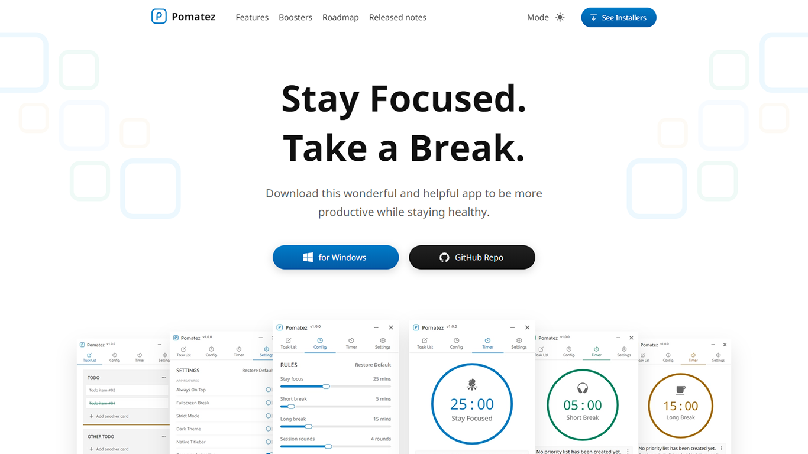

<p align="center">
  <a href="https://roldanjrcodearts9711.github.io/productivity-timer/">
    
  </a>
</p>

<h1 align="center">PRODUCTIVITY TIMER</h1>

<p align="center">
  Responsive download page for this multi-platform time management app <br> based on Pomodoro Technique.
  <br>
  <br>
  <a href="https://roldanjrcodearts9711.github.io/productivity-timer/">Official Website Link</a>
  <br>
  <br>
</p>

[](https://snapcraft.io/productivity-timer)
[](https://travis-ci.com/roldanjrCodeArts9711/productivity-timer)
[](https://github.com/roldanjrCodeArts9711/productivity-timer/releases)
[](https://github.com/roldanjrCodeArts9711/productivity-timer/releases)
[](https://github.com/roldanjrCodeArts9711/productivity-timer/blob/master/LICENSE)




## 🛠 Installation & Set Up

1. Install the Gatsby CLI

   ```sh
   npm install -g gatsby-cli
   ```

2. Install and use the correct version of Node using [NVM](https://github.com/nvm-sh/nvm)

   ```sh
   nvm install
   ```

3. Install dependencies

   ```sh
   yarn
   ```

4. Start the development server

   ```sh
   npm start
   ```

## 🚀 Building and Running for Production

1. Generate a full static production build

   ```sh
   npm run build
   ```

1. Preview the site as it will appear once deployed

   ```sh
   npm run serve
   ```

## License

MIT © [Roldan Montilla Jr](https://github.com/roldanjrCodeArts9711)
